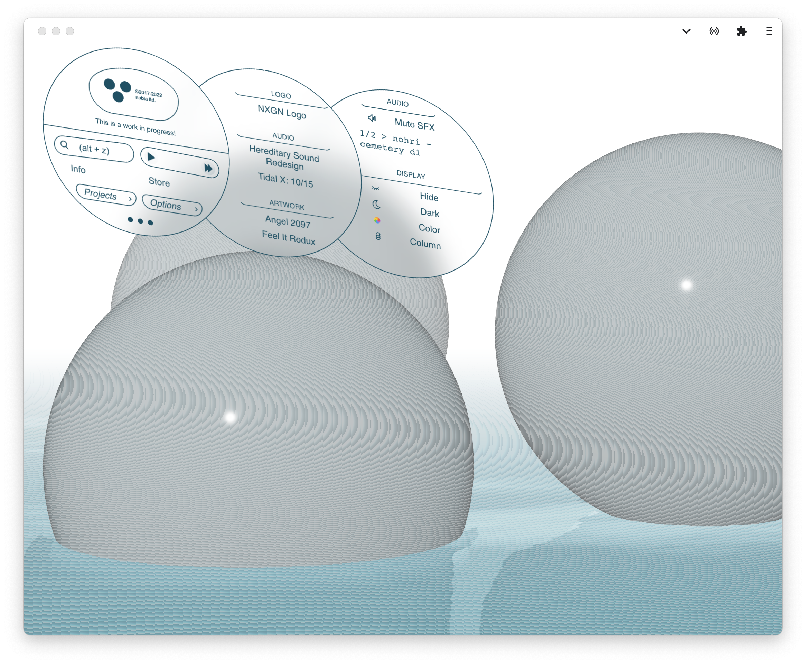

# Inside nabla.ooo

This is the homepage for digital studio, Nabla Ltd.

## Update 2

##### CD

- [ ] Conversation and auth
- [x] Greeting quote from CD
- [ ] Loading animation

#### Keybindings

- [x] Hold ‘shift’ to highlight panels
- [x] Press ‘esc’ to get out of overlays and search input
- [x] Search is now 'alt+z'

#### Pages

- [ ] Home contains new welcome splash screen
- [ ] Info redesigned and populated with information
- [x] Store redesined with tilt animation for items

#### Projects

- [x] Creator initial medals for projects with statements
- [x] Descriptions for images in overlays
- [ ] Documentation for all projects
- [x] Icons for programs used for all projects
- [x] Links for projects
- [ ] Router makes individual pages for projects
- [ ] &nbsp;&nbsp;&nbsp;&nbsp;&nbsp;&nbsp; using cloud functions generated LOT#

#### Search

- [x] Live Search functional
- [x] Search Results overlay

#### Misc.

- [x] Persistent state
- [x] Music playing status follows on-device control
- [x] Major styling adjustments
- [x] Resizable project cards (Note: the cards might jitter on pages with more than one project.)

## Links

- [nabla.ooo/](https://nabla.ooo/)
- [beta.nabla.ooo/](https://beta.nabla.ooo/)

## Etc.

This project was bootstrapped with [Create React App](https://github.com/facebook/create-react-app).
Parts of the canvas were adapted from [frosty-reflector](https://codesandbox.io/s/23xxw) by Marco Ludovico Perego.
Many of the SVG icons used were either created by me or sourced from [The Noun Project](https://thenounproject.com/).
